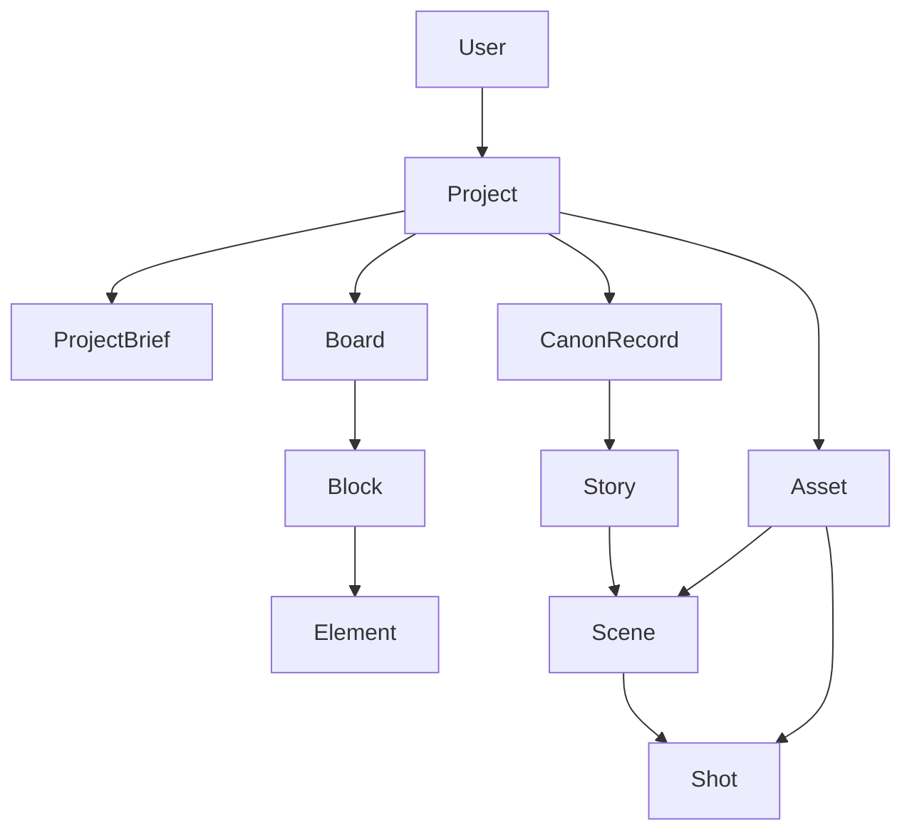

# Data Model

## Overview

The pivot changes the conceptual data model from `world -> entities` to `project -> boards -> canon/assets -> exports`.

The implementation can migrate in stages. For now, the existing `worlds` table is treated as the current storage representation of a **Project**.

## Core Model

## Transitional Mapping

| Conceptual Model | Current Implementation |
|------------------|------------------------|
| `Project` | `worlds` |
| `Asset` | `characters`, `locations`, `organizations`, `items` |
| `Canon record` | `stories`, `events`, `rules`, imported notes |
| `Scene` | `scenes` |
| `Shot` | `shots` |

This lets the product pivot immediately while the database evolves incrementally.

## Primary Concepts

### 1. Project

The top-level container for a film, episode, short, campaign, or animated piece.

Suggested fields:

- `id`
- `owner_id`
- `name`
- `format` - short film, feature, episode, sequence, campaign
- `logline`
- `genre`
- `tone`
- `audience`
- `status`
- `created_at`
- `updated_at`

### 2. Project Brief

The canonical early-stage summary used to seed the rest of the workflow.

Suggested fields:

- `project_id`
- `premise`
- `creative_goal`
- `constraints`
- `references`
- `success_criteria`
- `notes`

### 3. Boards

Boards are the primary workspace and should be stage-aware.

Recommended board types:

- `planning`
- `ideation`
- `scripting`
- `design`
- `storyboard`

Suggested fields:

- `id`
- `project_id`
- `type`
- `title`
- `order_index`
- `is_active`
- `created_at`
- `updated_at`

### 4. Blocks

Blocks are the main output units on a board. They should be lineage-aware.

Examples:

- concept directions
- scene lists
- character directions
- style frames
- shot sequences

Suggested fields:

- `id`
- `board_id`
- `parent_block_id` - lineage / branch origin
- `block_type`
- `title`
- `status` - draft, approved, archived
- `created_by`
- `created_at`
- `updated_at`

### 5. Elements

Elements are the fine-grained units inside a block that can be individually refined.

Examples:

- a single beat inside a story outline
- one character concept inside a design block
- one shot inside a storyboard block

Suggested fields:

- `id`
- `block_id`
- `element_type`
- `content`
- `order_index`
- `metadata`

### 6. Canon Records

Canon is the approved memory layer that supports future stages.

Canon should include:

- stories
- scene context
- rules and constraints
- approved notes and references
- project history / important events

Suggested fields:

- `id`
- `project_id`
- `record_type`
- `source_board_id`
- `source_block_id`
- `title`
- `content`
- `status`
- `approved_at`

### 7. Assets

Assets are reusable visual planning inputs.

Current tables already cover the first asset families:

- characters
- locations
- organizations
- items

These should remain reusable across boards, scenes, and exports.

### 8. Stories, Scenes, and Shots

These remain critical because they are where the workflow becomes production-shaped.

#### Story

High-level narrative container.

#### Scene

Breakdown unit for sequencing, blocking, and storyboard planning.

#### Shot

Visual planning unit for storyboard and export workflows.

## Relationship Rules

### Boards Produce Canon

Approved board output should be promotable into canon without duplication.

### Canon Feeds Boards

Future generations should always be able to pull context from approved canon.

### Assets Support Both

Assets should be visible and reusable in:

- canon records
- scenes
- shots
- storyboard references
- exports

## Agent Model

The data model should support a coordinating agent architecture:

- `Core Agent` - stage management, progress tracking, routing, validation
- `Specialized agents` - ideation, scripting, design, storyboard/art

This does not require full autonomous agents on day one, but the model should make it possible.

## First Slice Priorities

The first implementation slice does not need the full ideal model. It needs:

1. Project identity
2. Stage-aware board surfaces
3. Reusable stories / scenes / shots
4. Canon and asset views
5. A way to preserve lineage conceptually, even if the initial implementation is lightweight
