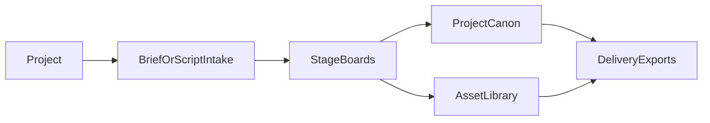

# Vixio Studio - Product Overview

## Tagline

**From brief or script to visualized preproduction.**

## What It Is

Vixio Studio is an **AI-assisted, visualization-first preproduction workspace** for creators who need more than a chat window but less than an enterprise production stack.

The product starts with a **project** and supports two equal entry paths:

- **Project brief** - for original concepts, pitches, and early creative direction
- **Script breakdown** - for existing scripts, scene drafts, and treatments

From there, the product organizes work into **stage-aware boards** that help creators move through planning, ideation, scripting/breakdown, design, and storyboard development while preserving continuity.

## Product Model

Vixio is no longer framed as `Worldbuilder -> Studio`.

Instead, the product model is:

### The New Mental Model

| Layer | Purpose |
|-------|---------|
| **Project** | The top-level container for a film, short, episode, campaign, or animation concept |
| **Boards** | The main workspace for exploring and refining multi-stage outputs |
| **Canon** | Approved narrative and reference context that supports later stages |
| **Assets** | Characters, locations, organizations, props, and visual references used across boards |
| **Exports** | Shotlists, project bibles, storyboard-ready docs, and other handoff outputs |

## Core Differentiator

The core differentiator is now **workflow coordination and visualization**, not worldbuilding depth.

Vixio wins when it helps creators:

1. Keep outputs coherent across stages
2. See progress and trace decisions visually
3. Refine specific blocks or elements without losing context
4. Use AI as a coordinator and assistant, not just a generator

This draws directly from the strongest insight in the AnimAgents paper: creators do not mainly need more raw ideas. They need help **organizing, tracing, and visualizing multi-stage preproduction work**.

## Main Product Surfaces

### 1. Overview

The project control room.

- Current project summary
- Workflow progress
- Quick start actions
- Visibility into canon, assets, and export readiness

### 2. Boards

The main workspace.

- Planning board
- Ideation board
- Scripting / breakdown board
- Design board
- Storyboard board
- Branches, versions, and element-level refinement

### 3. Canon

The durable memory layer.

- Stories and scene context
- Timeline and project history
- Rules, constraints, and reference notes
- Imported supporting material

### 4. Assets

The reusable visual planning layer.

- Characters
- Locations
- Organizations
- Props / items
- Relationship graph

### 5. Exports

The final stage of the workflow.

- Project bible / markdown export
- JSON export
- Future: scene breakdowns, shotlists, storyboard packages, screenplay exports

### 6. Agent Chat

The coordination interface.

- Ask about project state
- Surface gaps and inconsistencies
- Request next-step recommendations
- Trigger or guide stage work

## Target Users

### Primary

Creators doing real preproduction work:

- Independent filmmakers
- Writer-directors
- Small production teams
- Animation creators and storyboard-heavy teams
- Creators doing pitch development or visual preproduction without enterprise tooling

### Secondary

People with canon-heavy workflows who still need visualization:

- Screenwriters managing continuity
- Narrative designers
- Worldbuilders who want visual planning, not wiki maintenance
- Creative leads organizing concept development before production

### Flagship Vertical

Animation remains the strongest reference workflow because its stages are explicit and board-friendly. But the product is positioned as **general preproduction first**, not animation-only.

## Workflow Design Principles

### Brief and Script Are Equal Entry Points

The product must not force creators into worldbuilding before they can visualize.

### Boards First, Forms Second

Chat and structured data support the workflow, but the product should feel like a creative workspace, not a database.

### Canon Supports Boards

Canon matters because it preserves decisions and references, not because users want to fill encyclopedias.

### AI Coordinates, Humans Decide

AI should reduce filtering, organization, and continuity overhead while keeping key creative decisions human-led.

## Current Technical Direction

| Layer | Technology |
|-------|------------|
| Framework | Next.js 16 (App Router) |
| Language | TypeScript |
| Styling | Mantine + Tailwind CSS v4 |
| Database | Supabase (PostgreSQL) |
| Auth | Supabase Auth |
| AI | OpenAI / Anthropic / compatible LLM APIs |
| Visualization | Board-style surfaces first, graph support second |
| Deployment | Vercel |

## Transitional Note

The current application still uses `worlds` in the database and several existing entity CRUD routes. During the pivot:

- `World` is treated as the current implementation name for a **Project**
- Existing entity routes become backing surfaces for **Canon** and **Assets**
- New top-level navigation and documentation shift the product identity immediately, even before the full data model is migrated

## Document Map

| Document | Purpose |
|----------|---------|
| [mission.md](./mission.md) | Problem, market, and value proposition |
| [product-philosophy.md](./product-philosophy.md) | Design principles for the pivot |
| [roadmap.md](./roadmap.md) | Phase sequencing |
| [workspace-model.md](./workspace-model.md) | Project, boards, blocks, lineage, and agent model |
| [features/import-design.md](./features/import-design.md) | Project intake |
| [features/visualization-design.md](./features/visualization-design.md) | Stage boards |
| [features/export-design.md](./features/export-design.md) | Delivery exports |
